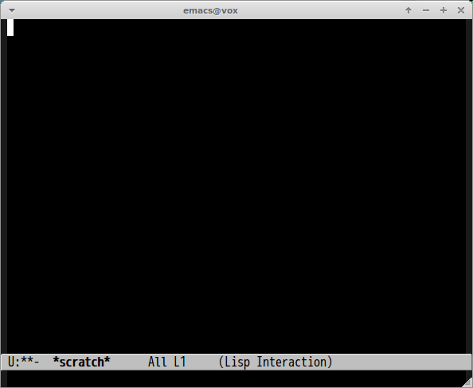

# codic.el [](https://travis-ci.org/syohex/emacs-codic)

[Codic](http://codic.jp/) for Emacs. [Codic](http://codic.jp/) is naming dictionary
service for Japanese programmers and system engineers. This service is useful for
naming class names, method names, variables name database column etc.

This package Emacs port of [Codic.vim](https://github.com/koron/codic-vim)


## ScreenCast

### Japanese




### English


## Installation

You can install `codic.el` from [MELPA](http://melpa.milkbox.net/) with package.el.
If you use [Cask](https://github.com/cask/cask), put following code to your Cask file.

```lisp
(depends-on "codic")
```

## Command

#### `M-x codic keyword`

Search keyword from Codic dictionary. If `keyword` starts with English alphabet,
`codic.el` assumes keyword is English.
